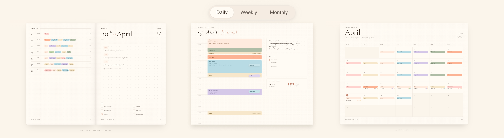
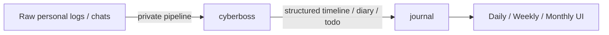
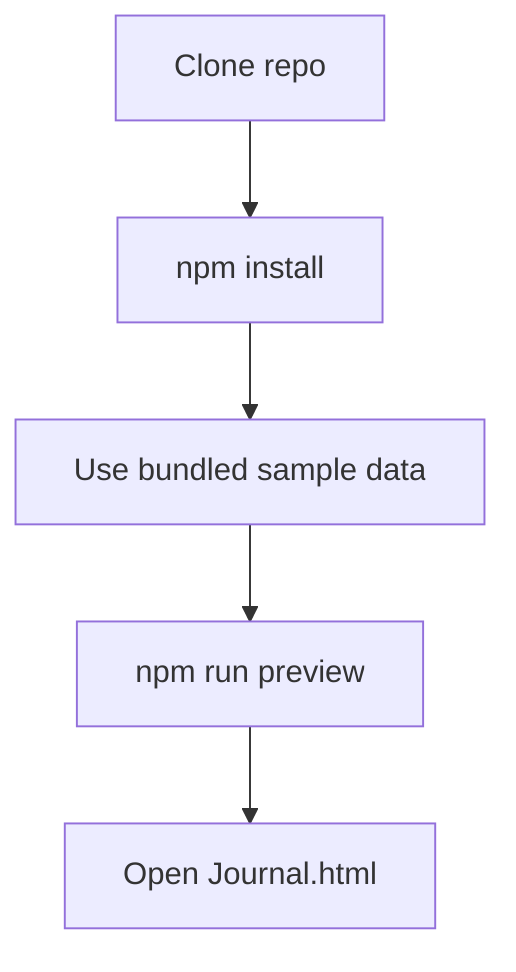

# Journal

> Turn structured personal timeline data into a daily, weekly, and monthly journal UI.



Live demo: <https://bombomlab.github.io/Journal/public/Journal.html>

## Overview

`journal` is the public frontend for browsing structured personal timeline data. It renders a paper-like `daily / weekly / monthly` reading experience from three input types:

- `timeline` events
- `diary` summaries and entries
- `todo` items

This repository is a UI layer. It is not the full ingestion or extraction pipeline.

## Project Context

The project sits downstream of structured life-log data. Its purpose is to make already-structured records easier to read, review, and revisit, rather than to capture or extract them.

- Upstream data source: [`cyberboss`](https://github.com/WenXiaoWendy/cyberboss)
- Related reference: [`timeline-for-agent`](https://github.com/WenXiaoWendy/timeline-for-agent)
- This repo's responsibility: frontend rendering, sample data, and browser preview

## System Boundary



What this repository includes:

- The public Journal frontend
- Sanitized sample data under [`data/public/`](../data/public/)
- Build and preview scripts
- Data shaping logic used by the browser UI

What this repository does not include:

- Raw WeChat or chat-log ingestion
- The full private extraction workflow from chats to structured records
- Private prompts, adapters, or account-specific sync steps
- Real personal diary / timeline / todo data

## About "WeChat Claw" and Cyberboss

Earlier drafts of this README blurred together the public frontend and a private data-preparation workflow. The accurate boundary is:

- `cyberboss` is the upstream structured-data producer
- `journal` consumes Cyberboss-compatible structured data
- This repository does not publish the full private workflow from raw chats to `Event / Summary / Todo`

If you already have a compatible structured dataset, you can use this frontend without adopting the author's private capture pipeline.

## Data Input Modes

### Mode A: Use the bundled sample data

This is the default open-source path.

- Sanitized sample timeline data lives in [`data/public/timeline-state.json`](../data/public/timeline-state.json)
- Sanitized diary markdown lives in [`data/public/diary/`](../data/public/diary/)
- Sanitized todos live in [`data/public/todos.json`](../data/public/todos.json)

This mode is what `npm run preview` is expected to show.

### Mode B: Use Cyberboss-compatible structured data

You can also point the frontend at your own structured data if it matches the expected contracts.

- Timeline contract: [schemas/timeline.md](schemas/timeline.md)
- Diary contract: [schemas/diary.md](schemas/diary.md)
- Todo contract: [schemas/todo.md](schemas/todo.md)

The frontend does not require that your data literally come from `cyberboss`, but it does expect a Cyberboss-compatible shape.

## Data Contracts

The frontend consumes three structured inputs:

| Input | Purpose | Status |
| --- | --- | --- |
| `timeline` | timed events, taxonomy, event spans | required |
| `diary` | day-level summaries and entry text | recommended |
| `todo` | checklist items for a given day | optional |

Behavior when data is missing:

- Missing `timeline`: the core views cannot render correctly
- Missing `diary`: the UI falls back to event-derived summaries or empty sections
- Missing `todo`: the checklist section is hidden or empty

Detailed schema references:

- [Timeline schema](schemas/timeline.md)
- [Diary schema](schemas/diary.md)
- [Todo schema](schemas/todo.md)
- [Compatibility notes](schemas/versioning.md)

## Compatibility and Maintenance

Current contract target:

- `schemaVersion`: `journal-v1`
- `timezone`: `Asia/Shanghai` in the sample dataset
- Input style: Cyberboss-compatible `timeline / diary / todo`

Stability expectations:

- Core timeline event fields are treated as stable inputs
- Diary markdown formatting is lighter-weight and may evolve
- Weekly and monthly views are derived from daily data, so upstream field changes can affect aggregation behavior

If Cyberboss changes its data shape, `journal` may also need a matching adapter or frontend update.

## Project Structure

```text
src/
  app UI, runtime entry, and browser-side data shaping

data/public/
  sanitized sample timeline, diary markdown, and todos

data/private-source/
  intentionally empty in the public repo

scripts/
  build, sanitize, and local preview utilities

public/
  browser entry and compiled runtime bundle

docs/schemas/
  public input contracts for timeline / diary / todo
```

## Quick Start

```bash
npm install
npm run preview
```

Local preview:

```text
http://localhost:8767/Journal.html
```

Build the runtime bundle explicitly:

```bash
npm run build
```

## Local Preview Flow



## Privacy

The public repository is intended to ship only sanitized sample data.

- Keep real personal sources outside this repo
- Do not commit private timeline exports into `data/public/`
- Treat `data/private-source/` as local-only working space

## License

This repository includes original UI and frontend code for Journal, plus ideas and structural references from upstream projects. If you reuse code here, check the upstream repositories and their licenses as well:

- [`cyberboss`](https://github.com/WenXiaoWendy/cyberboss)
- [`timeline-for-agent`](https://github.com/WenXiaoWendy/timeline-for-agent)
